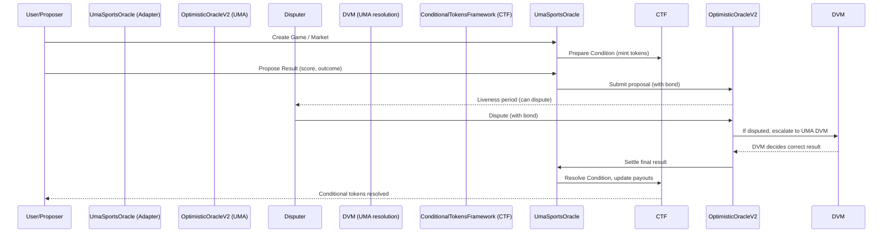

Yes, you can consider `requestPrice` as the **first step in creating a prediction market** in the Oracle system, but it's important to understand the distinction:

## `requestPrice` vs. Creating a Prediction Market

### What `requestPrice` Actually Does:
- **Creates a price resolution request** for an **existing** prediction market
- **Does NOT create the prediction market itself**
- Sets up the oracle infrastructure to resolve the market's outcome

### The Complete Prediction Market Creation Process:

1. **Market Creation** (happens elsewhere, likely in CTF/Exchange contracts):
   - Create the conditional tokens
   - Set up the market structure
   - Define possible outcomes

2. **Oracle Resolution Request** (`requestPrice`):
   - Request the oracle to resolve the market
   - Provide bond/collateral for the resolution
   - Set dispute window (liveness period)

3. **Price Proposal** (by whitelisted proposers):
   - Propose the actual outcome/price
   - Can be binary (0/1) or multi-outcome (scores, etc.)

4. **Dispute Period** (optional):
   - Anyone can dispute the proposed price
   - Requires additional bond

5. **Settlement**:
   - Automatic if undisputed
   - Manual resolution if disputed

## In Your Oracle System:

```solidity
// This creates a REQUEST for resolution, not the market itself
oracle.requestPrice(REQUEST_ID, ancillaryData, bond, liveness);
```

The `ancillaryData` ("NBA Game ID:123, Market Type:Winner") describes what needs to be resolved, but the actual market tokens and structure were created separately.

## Think of it as:
- **Market Creation** = Setting up the betting pool and tokens
- **`requestPrice`** = Hiring an oracle to determine the winner
- **Proposal/Dispute/Settlement** = The oracle's decision-making process

So while `requestPrice` is essential for the prediction market's **resolution process**, it's not the market creation itself - it's the oracle engagement step.
