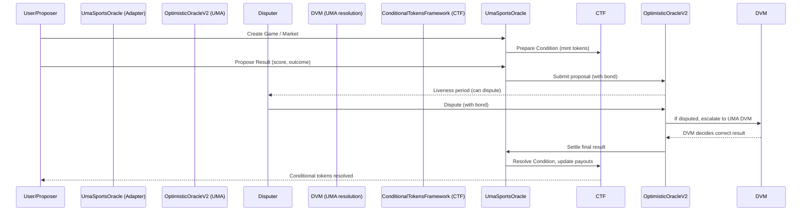

```mermaid
sequenceDiagram
    participant User/Proposer
    participant UmaSportsOracle (Adapter)
    participant OptimisticOracleV2 (UMA)
    participant Disputer
    participant DVM (UMA resolution)
    participant ConditionalTokensFramework (CTF)
    
    User/Proposer->>UmaSportsOracle: Create Game / Market
    UmaSportsOracle->>CTF: Prepare Condition (mint tokens)
    User/Proposer->>UmaSportsOracle: Propose Result (score, outcome)
    UmaSportsOracle->>OptimisticOracleV2: Submit proposal (with bond)
    OptimisticOracleV2-->>Disputer: Liveness period (can dispute)
    Disputer->>OptimisticOracleV2: Dispute (with bond)
    OptimisticOracleV2->>DVM: If disputed, escalate to UMA DVM
    DVM-->>OptimisticOracleV2: DVM decides correct result
    OptimisticOracleV2->>UmaSportsOracle: Settle final result
    UmaSportsOracle->>CTF: Resolve Condition, update payouts
    CTF-->>User/Proposer: Conditional tokens resolved
```

